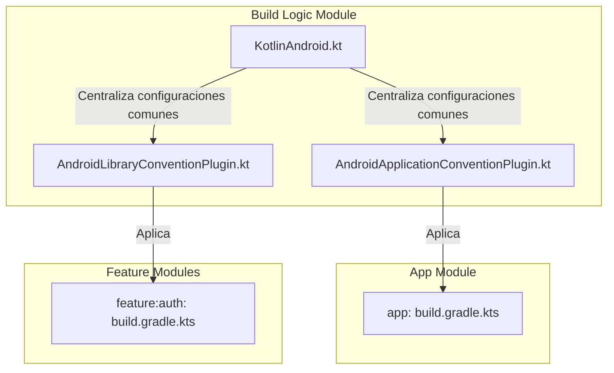

# Propuesta Arquitectónica: Modularización Correcta con Gradle Convention Plugins

Este documento presenta la propuesta técnica para estructurar correctamente la modularización del proyecto **Mirainime** utilizando **Convention Plugins** centralizados en Kotlin DSL.

---

## 🎯 Objetivo

Implementar una arquitectura de construcción (build architecture) limpia, desacoplada y escalable que permita crear y configurar módulos de tipo **Android Library** (como `:feature:auth`) de forma automatizada y sin colisiones de `namespace` ni inconsistencias de paquetes.

---

## 🔍 Análisis y Diagnóstico Actual

Actualmente, el proyecto cuenta con soporte para plugins de convención en el build compuesto `build-logic`, pero tiene varios impedimentos técnicos de diseño:

1. **Acoplamiento de Namespace en `KotlinAndroid`**: La función `configureKotlinAndroid` configura el `namespace` de manera global y estática a `"com.miraitag.mirainime"`. Esto romperá cualquier intento de modularización, ya que múltiples módulos no pueden compartir el mismo namespace en Android.
2. **Falta de Plugin para Librerías**: No existe un plugin de convención para módulos que no sean aplicaciones. `:feature:auth` es una Android Library y no puede aplicar el plugin de aplicación.
3. **Inconsistencia de Paquete en `:feature:auth`**: El paquete de `:app` es `com.miraitag.mirainime`, pero en `:feature:auth` se estructuró físicamente como `com.mirainime.feature.auth` (omitiendo el subdominio raíz `miraitag`). Esto causa inconsistencias de dominio en el proyecto.

---

## 🛠️ Propuesta de Cambios

Para resolver esto de raíz y con el máximo rigor de ingeniería, aplicaremos los siguientes cambios estructurales:



---

### Componente 1: Build Logic (Convenciones de Gradle)

#### 📝 [MODIFY] [KotlinAndroid.kt](file:///Users/tahuilan/AndroidStudioProjects/mirainime/build-logic/convention/src/main/kotlin/com/miraitag/mirainime/KotlinAndroid.kt)
* **Acción**: Eliminar la asignación directa de `namespace = "com.miraitag.mirainime"` dentro del bloque `commonExtension.apply`.
* **Razón**: Cada módulo debe ser libre de declarar su propio namespace único.

#### 📝 [MODIFY] [AndroidApplicationConventionPlugin.kt](file:///Users/tahuilan/AndroidStudioProjects/mirainime/build-logic/convention/src/main/kotlin/AndroidApplicationConventionPlugin.kt)
* **Acción**: Configurar explícitamente el namespace en la extensión de la aplicación antes de configurar Kotlin:
  ```kotlin
  extensions.configure<ApplicationExtension> {
      namespace = "com.miraitag.mirainime"
      configureKotlinAndroid(this)
      ...
  }
  ```
* **Razón**: El módulo `:app` es el contenedor principal y debe poseer el namespace base de la aplicación.

#### 📝 [NEW] [AndroidLibraryConventionPlugin.kt](file:///Users/tahuilan/AndroidStudioProjects/mirainime/build-logic/convention/src/main/kotlin/AndroidLibraryConventionPlugin.kt)
* **Acción**: Crear un nuevo plugin de convención para bibliotecas de Android.
* **Detalle**:
  ```kotlin
  import com.android.build.api.dsl.LibraryExtension
  import com.miraitag.mirainime.configureKotlinAndroid
  import org.gradle.api.Plugin
  import org.gradle.api.Project
  import org.gradle.kotlin.dsl.configure

  class AndroidLibraryConventionPlugin : Plugin<Project> {
      override fun apply(target: Project) {
          with(target) {
              with(pluginManager) {
                  apply("com.android.library")
              }
              extensions.configure<LibraryExtension> {
                  configureKotlinAndroid(this)
                  defaultConfig.apply {
                      testInstrumentationRunner = "androidx.test.runner.AndroidJUnitRunner"
                  }
              }
          }
      }
  }
  ```
* **Razón**: Encapsular y estandarizar la configuración para todos los módulos de tipo biblioteca en el futuro.

#### 📝 [MODIFY] [build.gradle.kts (build-logic)](file:///Users/tahuilan/AndroidStudioProjects/mirainime/build-logic/convention/build.gradle.kts)
* **Acción**: Registrar el nuevo plugin de biblioteca bajo el ID `mirainime.android.library`.
  ```kotlin
  register("androidLibrary") {
      id = "mirainime.android.library"
      implementationClass = "AndroidLibraryConventionPlugin"
  }
  ```

---

### Componente 2: Módulo `:feature:auth`

#### 📝 [MODIFY] [build.gradle.kts (feature:auth)](file:///Users/tahuilan/AndroidStudioProjects/mirainime/feature/auth/build.gradle.kts)
* **Acción**: Aplicar el nuevo plugin de convención de librería y declarar su namespace correcto de forma explícita.
  ```kotlin
  plugins {
      id("mirainime.android.library")
  }

  android {
      namespace = "com.miraitag.mirainime.feature.auth"
  }

  dependencies {
      // Dependencias específicas del módulo (por ejemplo, Compose, Jetpack, etc.)
  }
  ```

#### 📁 [MODIFY] [Estructura de paquetes (feature:auth)](file:///Users/tahuilan/AndroidStudioProjects/mirainime/feature/auth/src/main/java)
* **Acción**: Renombrar y mover la estructura física de directorios de `com/mirainime/feature/auth` a `com/miraitag/mirainime/feature/auth` para mantener una jerarquía consistente de dominio.

---

## 📈 Alternativas y Trade-offs

| Alternativa | Ventajas | Desventajas / Riesgos |
| :--- | :--- | :--- |
| **Definir namespaces de forma dinámica en KotlinAndroid** (usando la ruta del módulo Gradle). | Automatiza la asignación de namespaces de forma mágica (e.g. `:feature:auth` -> `com.miraitag.mirainime.feature.auth`). | Hace el build menos explícito y más difícil de rastrear si se cambia de nombre una carpeta. Rompe si hay caracteres especiales en las rutas. |
| **Propuesta (Namespaces explícitos en cada módulo)**. | **Recomendada por Google**. Rigurosa, transparente y fácil de entender. Permite refactorizaciones de carpetas sin alterar los namespaces de forma inesperada. | Requiere escribir 3 líneas de código en el `build.gradle.kts` de cada módulo nuevo. |

---

## 🛡️ Plan de Verificación

### Pruebas Automatizadas
* Ejecutar `./gradlew compileDebugKotlin` para verificar que la compilación de todos los módulos (incluyendo el de biblioteca) compile sin problemas de tipos ni imports.
* Ejecutar `./gradlew app:assembleDebug` para empaquetar el APK completo e inspeccionar que no haya colisiones de recursos ni archivos duplicados.

### Pruebas Manuales
* Sincronizar Gradle en el entorno y certificar que la estructura de paquetes física del módulo `:feature:auth` coincida con su namespace.
